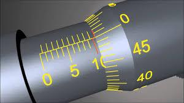

# Лабораторная работа №1. Измерение линейных размеров и определение плотности тел, имеющих правильную геометрическую форму

**Цель работы:** Освоение методов проведения прямых и косвенных измерений физических величин и определения погрешностей полученных результатов.

## Теоретическое введение

**Методика измерений.** _Измерить_ --- значит сравнить измеряемую величину с эталонной, что и производится измерительными приборами. Конечным элементом любого прибора является индикатор, представляющий результаты для визуального восприятия. Во многих приборах, кроме того, имеются индикаторы, служащие для начального выставления данных работы прибора (например, для установки частоты генераторов и т.д.). Индикатор должен обеспечить удобство считывания и достаточную точность, соответствующую точности самого прибора. В современных приборах высокого класса точности используется цифровая индикация. В менее точных приборах продолжает применяться аналоговая индикация с использованием шкал разных типов (например, стрелочные приборы и др.). Аналоговое представление информации более наглядно, особенно если нужно следить за быстро изменяющейся величиной. Преимуществом аналоговой индикации являются также простота и надежность, отсутствие необходимости цифровой обработки и источников питания. Поэтому индикация по шкалам широко используется в переносных и других приборах невысокого класса точности. В ряде случаев и высокоточные приборы содержат как цифровой, так и аналоговый индикаторы (для качественного представления результата).

_Точность_ результатов измерений зависит от _точности приборов_ и от _точности метода_ измерений. Точность измерений определяется той наименьшей частью единицы меры, до которой с уверенностью в правильности результата можно вести измерения.

**Измерение линейных размеров.** Наиболее простым измерительным прибором является **_линейка_** (Рис. 1). Величина наименьшего деления линейки называется _ценой деления_.

<figure>

Рис. 1. Вид масштабной линейки
</figure>

Для определения цены деления линейки, которая обычно обозначается буквой $C$, необходимо: выбрать два соседних значения на шкале линейки; подсчитать число делений между этими значениями; разность соседних значений разделить на количество делений между ними. На Рис. 2 изображены три линейки с одинаковыми верхними пределами (25 см), но с различной точностью измерения.

<figure>

а

б

в

Рис. 2. Линейки с различной точностью измерения.
</figure>

Так, в случае линейки _а_ --- $C_а = 1\ см \div 10\ дел = 0,1\ см/дел$, для линейки _б_ --- $C_б = 1\ см \div 5\ дел = 0,2\ см/дел$, для линейки _в_ --- $C_в = 1\ см : 2\ дел = 0,5\ см/дел$.

**_Повысить точность считывания со шкалы можно следующими способами._**

**1.** _Уменьшить цену деления._ Например, если на большой транспортир нанести больше делений, то цена деления уменьшится. Этот способ иллюстрирует Рис. 3. Справа цена деления равна пяти градусам, слева – одному градусу. Обычно транспортиры выпускаются с двумя шкалами: с большей ценой деления (Рис. 4, нижняя шкала) и меньшей ценой деления (Рис. 4, верхняя шкала). На шкалу линейки обычно наносят деления через 1 мм и очень редко через 0,5 мм, поскольку меньшую цену деления сложно считывать невооруженным глазом.

<figure>

Рис. 3. Иллюстрация повышения точности измерения угловых размеров путем уменьшения цены деления.
</figure>

Для увеличения точности в некоторых приборах используется подвижный указатель, который плавно перемещается вдоль линейки по принципу винта. Такой принцип реализован в устройстве микрометра: на барабан винта по окружности нанесены 50 делений (рис. 5). Полный поворот барабана обеспечивает поступательное движение винта на 0,5 мм. В результате цена деления микрометра равна 0,01 мм.

<figure>

Рис. 4. Промышленный транспортир с двумя шкалами.
</figure>

<figure>

Рис. 5. Иллюстрация повышения точности измерения линейных размеров путем использования принципа винта.
</figure>

**2.** _Использовать несколько шкал с возрастающей точностью._ Первая шкала позволяет грубо выбрать определенный интервал, что дает первые 1--2 цифры результата. Каждая последующая шкала обеспечивает возможность измерения в пределах цены деления предыдущей шкалы. Такой метод используется, например, в стрелочных часах (часовая, минутная и секундная шкалы), секундомерах, а также в микрометре.

**3.** _Использовать нониус_ --- вспомогательную
шкалу, которая позволяет увеличить в несколько раз точность считывания по существующей шкале.

<figure>

Рис. 6. Вид прибора Нониуса для измерения углов.
</figure>

Считается, что Авицена (он же Ибн
Сина, 980--1037 гг.) впервые описал принцип измерения углов с помощью приспособления типа нониуса. Современная конструкция шкалы для линейных измерений
была предложена в 1631 г. французским
математиком П.&nbsp;Вернье, в честь которого её
также называют «вернье́р». Название «нониус» это приспособление носит в честь
португальского математика Петра Нониуса, который раньше изобрёл прибор другой
конструкции, но использующий тот же
принцип. На Рис. 6 представлен вид прибора Нониуса. На квадранте Нониус провел
несколько концентрических дуг, разделив
первую на 90 частей, вторую --- на 89 частей
и т. д. Если измеряемый угол не выражается
целым числом девяностых частей квадранта, то может случиться так, что в
нем уложится целое число восемьдесят девятых или других имеющихся на
инструменте делений. Прибор Нониуса был неудобен, поэтому его вытеснил верньер, но название осталось.

Работа нониуса основана на следующем принципе. Точность визуальной интерполяции положения указателя между делениями шкалы низка
(около 1/3 деления), однако глаз может с гораздо большей точностью фиксировать точное совпадение двух рисок. Ошибка в регистрации такого
совпадения составляет доли толщины риски, что при тонких рисках значительно меньше, чем вышеупомянутая 1/3 расстояния между самими рисками. Нониус представляет собой связанную с указателем подвижную
шкалу, скользящую вдоль основной шкалы. Обычно на практике точность
считывания бывает 0,1 мм, 0,05 мм или 0,025 мм. Длина шкалы нониуса
тоже может быть разной: 39 мм, 19 мм, 9 мм (чаще используют 19 мм, реже 9 мм).

<figure>

Рис.7. Нониус штангенциркуля с точностью отсчета 0,1 мм.
</figure>

Например, шкала нониуса
длиной 9 мм разделена на 10 частей. Одно деление нониуса составляет 9/10 = 0,9 мм, что на
0,1 мм меньше миллиметра. Все
последующие штрихи нониуса
наносят с таким же интервалом.
Так как интервалы делений нониуса меньше, чем на основной
шкале, то постепенно накапливается отставание положения
штрихов нониуса от штрихов
основной шкалы, и десятый штрих нониуса совпадает с девятым штрихом
основной шкалы (рис.
7). Поэтому, если сдвинуть «0» нониуса на 0,1
мм от нуля основной
шкалы, то первое деление нониуса совпадет с
миллиметровым делением основной шкалы.

<figure>

Рис. 8. Шкала нониуса длиной 19 мм.
</figure>

Другой пример.
Пусть шкала нониуса
длиной 19 мм разделена
на части, по 1,9 мм каждая (рис. 8). Точность в этом случае такая же, как и
в предыдущем случае, но (для глаз) работать удобнее. Для отсчетов с точностью до 0,05 мм служит штангенциркуль, нониус которого изображен на
рис. 9. Шкала нониуса длиной 39 мм разделена на 20 равных частей. Каждое деление нониуса (39 : 20 = 1,95 мм) меньше двух делений штанги на
0,05 мм, что соответствует точности отсчета.

<figure>

Рис. 9. Шкала нониуса длиной 39 мм.
</figure>

Нониусы бывают
линейными и угловыми.
Инструментом, имеющим линейный нониус,
является штангенциркуль (внешний вид которого представлен на
рис. 10). Он состоит из
штанги (1), на которой
нанесена линейка с
миллиметровой шкалой (2) (масштаб), и подвижной рамки (3) с дополнительной шкалой (4) (нониусом), которая может перемещаться вдоль масштаба. При измерении линейных размеров тела его зажимают между губками (5) для внутренних измерений (например, внутреннего диаметра отверстий) или между губками (6) для наружных измерений. Для измерения
глубины отверстий используется линейка глубиномера (7). Для фиксации
подвижной рамки используется винт (8). Самый простой нониус --- десятичный. Точность измерения с таким нониусом равна 0,1 мм.

<figure>

Рис. 10. Внешний вид штангенциркуля
</figure>

Перед измерениями штангенциркулем нужно убедиться в его исправности. Инструмент пригоден для работы, если на нем не обнаружено забоин и других механических повреждений, его губки не имеют перекоса, нулевые штрихи нониуса и штанги совпадают, а между рамкой и штангой не
ощущается ни зазора, ни трения.

_Штангенциркуль показывает точные размеры в том случае, когда
он установлен правильно, без перекоса, его губки плотно соприкасаются с измеряемой деталью, но в то же время деталь имеет возможность скользить между губками._

Рис. 11 иллюстрирует примеры проведения измерений с помощью
штангенциркуля. Как видно из рис. 11*а*, на сантиметровой шкале штанги
левее нулевой риски нониуса находится цифра 2 (20 мм). Пятая риска нониуса совпала с риской 5 штанги (0,1 × 5 = 0,5 мм). Следовательно, результат измерения есть
20 мм + 0,5 мм = 20,5 мм.
